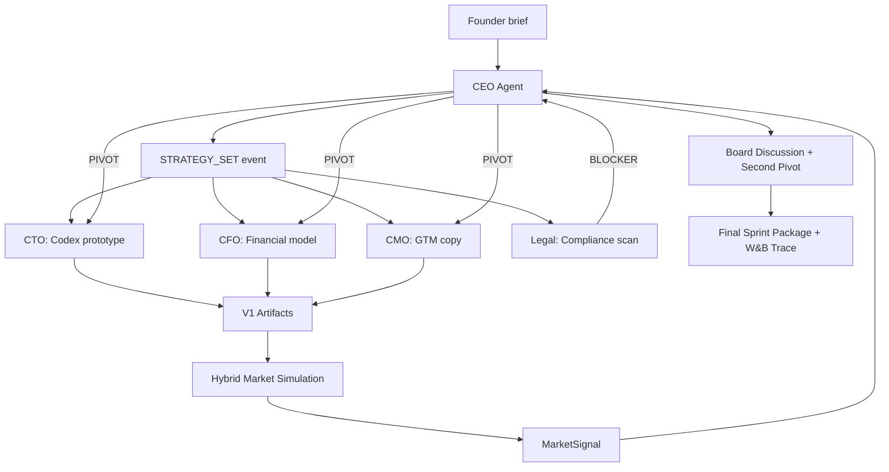

```
   ________                    __     ____                        __
  / ____/ /_  ____  _____/ /_   / __ ) ____  ____ _ _____/ /
 / / __/ __ \/ __ \/ ___/ __/  / __  |/ __ \/ __ `/ ___/ __ \
/ /_/ / / / / /_/ (__  ) /_   / /_/ / /_/ / /_/ / /  / /_/ /
\____/_/ /_/\____/____/\__/  /_____/\____/\__,_/_/  /_.___/

         Autonomous AI Executive Team
```


---

## Quick Demo (No API Key Required)

Try Ghost Board instantly with pre-cached results from a real Anchrix fintech sprint:

```bash
# Clone and install
git clone https://github.com/ayushozha/ghost-board.git
cd ghost-board
pip install -r requirements.txt

# Play back a full cached sprint -- no API key, no cost, instant replay
python main.py --cached
```

You will see the full CEO -> Legal -> PIVOT -> rebuild cascade printed to your terminal, including:
- 3 CEO strategy pivots triggered by real regulatory blockers
- 4 Legal blockers with FinCEN/CFPB/BSA citations and URLs
- CFO financial model evolution across pivots
- CMO GTM repositioning from consumer to enterprise B2B

To explore the interactive dashboard, open `dashboard/index.html` in your browser or run the React app:

```bash
cd dashboard-app
npm install && npm run dev
# then open http://localhost:5173
```

The dashboard works fully offline using the pre-built demo data in `outputs/`.

---

## What It Does

Ghost Board is an autonomous AI executive team that builds AND validates a startup in a single sprint. Five AI agents -- CEO, CTO, CFO, CMO, and Legal -- coordinate through an asynchronous event bus, each bringing specialized domain expertise to the table. The CEO sets initial strategy, the CTO generates a working prototype using OpenAI Codex, the CFO produces a twelve-month financial model with scenario analysis, the CMO crafts a full go-to-market package with competitive positioning, and the Legal agent scans real federal and state regulations. When Legal flags a compliance blocker with real regulatory citations (FinCEN MSB registration, CFPB rules, state money transmitter statutes), the CEO pivots strategy immediately, and the pivot cascades through every other agent, triggering a full rebuild of all artifacts. This inner feedback loop produces a v1 sprint package in minutes, not months.

After the initial build, Ghost Board launches a MiroFish-inspired market stress test. Synthetic stakeholders -- venture capitalists modeled on real firms like a16z and Paradigm, tech journalists covering fintech beats, early adopters, skeptics, competitors drawn from companies like Circle and Stripe, and regulators -- react to the startup in a multi-round turn-based simulation. The hybrid simulation engine combines 50 LLM-powered agents (full personality, real text responses via gpt-4o-mini) with up to one million lightweight agents (NumPy-vectorized stance floats, no LLM calls, updating in under one second per round). Their structured feedback flows back to the CEO, who pivots a second time if the market signals warrant it, and all agents rebuild again. The result is a complete sprint package -- working code, financial projections, GTM copy, compliance memo, and a full W&B execution trace -- produced for a fraction of a cent in API costs versus thousands of dollars in traditional consulting.

---

## Demo Screenshots

### Screen 1: Mission Control

*Dark terminal interface with pulsing cursor. Enter a startup concept, hit Launch Sprint, and watch five AI executives go to work.*

### Screen 2: The Boardroom

*Five agent cards connected by animated event bus lines. Watch Legal raise a blocker (red flash), CEO pivot (yellow cascade), and all agents rebuild in real time.*

### Screen 3: The Market Arena

*Three.js globe with persona dots at real geographic coordinates. Left: scrolling LLM agent post feed. Right: live sentiment charts updating each round.*

### Screen 4: Pivot Timeline

*Horizontal scrollable timeline with color-coded event nodes. Click any node to see the full payload, who triggered it, and what it triggered. Causal chains are visually connected.*

### Screen 5: Sprint Report

*Tabbed artifact viewer: syntax-highlighted prototype code, interactive financial model tables, rendered GTM landing page, compliance memo with highlighted citations, and the dramatic cost comparison.*

### Landing Page

*Marketing page with hero section, architecture flow, Ralphthon problem statement fit, numbers, and credits.*

---

## Architecture Diagram

Two nested feedback loops drive Ghost Board:

```
                              INNER LOOP
                     (Legal blocker -> CEO pivot)

    Founder brief
         |
         v
    +----------+
    |   CEO    |-----> STRATEGY_SET event
    +----------+
         |
    +----+----+----+----+
    |    |    |    |    |
    v    v    v    v    v
  CTO  CFO  CMO Legal  |
   |    |    |    |     |
   |    |    |    +---> BLOCKER (real citations)
   |    |    |          |
   |    |    |     +----+
   |    |    |     |
   |    |    |     v
   |    |    |   CEO processes blocker
   |    |    |     |
   |    |    |     +---> PIVOT event (cascades to all agents)
   |    |    |           |
   v    v    v           v
  Rebuild all artifacts with pivoted strategy
         |
         v
    V1 Artifacts (prototype, financial model, GTM, compliance memo)
         |
         v
                              OUTER LOOP
                   (Simulation -> second CEO pivot)

    +-------------------+
    | Hybrid Simulation |
    | 50 LLM agents     |
    | + 1M lightweight   |
    | agents (NumPy)    |
    +-------------------+
         |
         v
    MarketSignal (sentiment, concerns, strengths, pivot suggestion)
         |
         v
    +-----------+
    | CEO Board |-----> Presents findings to all agents
    | Discussion|<----- Each agent responds with proposals
    +-----------+
         |
         v
    PIVOT (if recommended)
         |
    +----+----+----+----+
    v    v    v    v    v
  CTO  CFO  CMO Legal  CEO
   |    |    |    |
   v    v    v    v
  Rebuild all artifacts with market-informed strategy
         |
         v
    Final Sprint Package + W&B Trace + Sprint Report
```



---

## Quick Start

```bash
# Clone and install
git clone https://github.com/ayushozha/ghost-board.git
cd ghost-board
pip install -r requirements.txt
cp .env.example .env  # Add your OpenAI API key

# Run on your own startup idea
python main.py "Your startup idea here"

# Run the pre-built Anchrix fintech demo
python main.py --demo

# Instant replay from cached data (no API calls, no cost)
python main.py --cached

# Choose a built-in concept by name
python main.py --concept anchrix
python main.py --concept coforge
python main.py --concept medpulse
python main.py --concept learnloop
python main.py --concept saas

# List available concepts
python main.py --list-concepts

# Control simulation scale
python main.py "Your idea" --sim-scale demo       # 30 LLM + 1,000 lightweight agents
python main.py "Your idea" --sim-scale standard    # 50 LLM + 10,000 lightweight agents
python main.py "Your idea" --sim-scale large       # 50 LLM + 100,000 lightweight agents
python main.py "Your idea" --sim-scale million     # 50 LLM + 1,000,000 lightweight agents

# Skip simulation (build phase only)
python main.py "Your idea" --skip-simulation

# Verbose output for debugging
python main.py "Your idea" --verbose

# JSON output for programmatic use
python main.py "Your idea" --json

# Live dashboard mode (opens browser, updates in real time)
python main.py "Your idea" --live

# Export PDF sprint report
python main.py "Your idea" --export-pdf
```

### Environment Variables

Create a `.env` file in the project root:

```bash
OPENAI_API_KEY=sk-your-key-here
WANDB_API_KEY=your-wandb-key          # Optional: enables W&B tracing
WANDB_PROJECT=ghost-board              # Optional: W&B project name
DATABASE_URL=postgresql+asyncpg://...  # Optional: PostgreSQL for history persistence
WEBHOOK_URL=https://hooks.slack.com/...# Optional: post-sprint notification webhook
```

---

## API Server

Ghost Board includes a full FastAPI backend that persists sprint data to PostgreSQL, streams live events over WebSocket, and serves the React dashboard.

### Running the Server

```bash
# Start the API server
python -m server.app
# or
uvicorn server.app:app --host 0.0.0.0 --port 8000 --reload

# In another terminal, start the React dashboard dev server
cd dashboard && npm run dev

# API: http://localhost:8000
# Dashboard: http://localhost:5173
```

### API Endpoints

| Method | Endpoint | Description |
|--------|----------|-------------|
| `POST` | `/api/sprint` | Start a new sprint. Body: `{concept, sim_scale}`. Returns `run_id`. |
| `GET` | `/api/runs` | List all past sprint runs from PostgreSQL. |
| `GET` | `/api/runs/{id}` | Get a specific run with trace, artifacts, and simulation results. |
| `GET` | `/api/runs/{id}/trace` | Get the event trace JSON for a run. |
| `GET` | `/api/runs/{id}/artifacts` | List artifact files produced by a run. |
| `GET` | `/api/runs/{id}/board-discussion` | Get the board discussion JSON. |
| `GET` | `/api/runs/{id}/simulation` | Get simulation results with geographic persona data. |
| `GET` | `/api/runs/{id}/sprint-report` | Get the generated sprint report markdown. |
| `GET` | `/api/runs/{id}/summary` | Get a compact summary of the run. |
| `GET` | `/api/stats` | Aggregate stats: total runs, total agents simulated, average cost, total pivots. |
| `GET` | `/api/concepts` | List available demo concepts with descriptions. |
| `GET` | `/api/health` | Health check endpoint. |
| `GET` | `/api/artifacts/{path}` | Serve a specific artifact file by path. |
| `WebSocket` | `/ws/live/{run_id}` | Live event stream. Receives agent actions, simulation rounds, and sprint completion in real time. |

### WebSocket Event Types

```json
{"type": "agent_action", "agent": "ceo", "status": "thinking"}
{"type": "event", "data": {"type": "STRATEGY_SET", "source": "CEO", "payload": {...}}}
{"type": "simulation_round", "round": 3, "sentiment": 0.23}
{"type": "sprint_complete", "summary": {"events": 35, "pivots": 3, "cost": 0.19}}
```

### Docker

```bash
docker compose up --build
```

This starts the FastAPI server, React dashboard (served via nginx), and PostgreSQL in a single command.

### Deployment (VPS)

```bash
# Full deployment (sync code, install deps, configure systemd + nginx)
./scripts/deploy.sh

# Sync code only (fast redeploy)
./scripts/deploy.sh sync

# Check service status
./scripts/deploy.sh status

# Tail live server logs
./scripts/deploy.sh logs
```

---

## React Dashboard

The dashboard is an interactive five-screen visualization that tells the story of a startup being built and validated by AI executives in real time. Built with Three.js for the 3D globe, Chart.js and D3.js for data visualization, and smooth CSS transitions between screens.

### Screen 1: Mission Control
Dark terminal aesthetic with a centered input field and a glowing "LAUNCH SPRINT" button. Entering a startup concept triggers a warp animation that transitions to the Boardroom. Displays the tagline: "Powered by 5 AI Executives | MiroFish Market Simulation | 1M+ Agents."

### Screen 2: The Boardroom
Five agent cards arranged in a circular layout connected by animated event bus lines. Each card shows the agent's avatar, name, role, status (idle, thinking, working, done, pivoting), and a preview of their current output. When Legal raises a blocker, the Legal card border flashes red and a red pulse line shoots to the CEO. When CEO pivots, the CEO card flashes yellow and yellow cascade lines fan out to all agents. A scrolling discussion feed below shows real agent reasoning pulled from `board_discussion.json`.

### Screen 3: The Market Arena
Three-panel layout with the Three.js globe as centerpiece. The globe spins with persona dots at real geographic coordinates (latitude and longitude from `simulation_geo.json`). Dots pulse when posting and are colored by stance -- green for positive, red for negative, yellow for neutral. Arc lines connect personas who reference each other. The left panel scrolls LLM agent posts with avatar, archetype badge, and stance indicator. The right panel shows live sentiment line charts per archetype updating each round, a total agent count ticker, and a round progress bar. The top bar displays: "Market Stress Test | Round 3/5 | 50 LLM + 1,000,000 Lightweight Agents | Avg Sentiment: +0.17."

### Screen 4: Pivot Timeline
A horizontal scrollable timeline where each node is an event from `trace.json`. Nodes are color-coded: blue for STRATEGY, red for BLOCKER, yellow for PIVOT, green for UPDATE, purple for SIMULATION_RESULT. Click any node to slide in a detail panel showing the full event payload, the event that triggered it, and the events it spawned. Pivot nodes are larger with an animated glow effect. Lines connect `triggered_by` chains to make the causal structure visually clear. Below the timeline, an artifact diff viewer shows what changed at each pivot point.

### Screen 5: Sprint Report
A tabbed interface with six tabs: Prototype (syntax-highlighted code with file tree sidebar), Financial Model (interactive table with revenue, cost, and runway charts), GTM (rendered landing page preview in an iframe plus positioning and taglines), Compliance (memo with highlighted and linkable regulatory citations), Cost (the dramatic bar chart comparing $0.19 API cost to $15,000 consulting equivalent, plus token breakdown per agent and total agents simulated counter), and Full Report (rendered sprint_report.md).

### Running the Dashboard

The dashboard is served as static HTML files with embedded JavaScript from `dashboard/`. For development:

```bash
# Open dashboard directly in browser
open dashboard/index.html

# Or serve via the FastAPI server
python main.py --serve
# Dashboard available at http://localhost:8000/dashboard/

# Or use the --live flag for real-time updates during a sprint
python main.py --live --demo
# Dashboard served at http://localhost:8080 and updates as agents work
```

---

## Simulation Scale

Ghost Board uses a hybrid simulation architecture combining LLM-powered agents with NumPy-vectorized lightweight agents. LLM agents have full personality, memory, and generate real text posts via gpt-4o-mini. Lightweight agents are pure math -- each has a stance float, influence float, drift rate, and archetype bias. Every round, lightweight agents update their stance based on a weighted average of nearby LLM agent sentiment plus random noise plus archetype drift, all computed via NumPy broadcasting. One million lightweight agents update in under one second per round.

| Scale | LLM Agents | Crowd Agents | Total Agents | Rounds | Typical Duration | Typical Cost |
|-------|-----------|--------------|--------------|--------|-----------------|-------------|
| `demo` | 30 | 1,000 | 1,030 | 5 | ~30 seconds | ~$0.03 |
| `standard` | 50 | 10,000 | 10,050 | 10 | ~2 minutes | ~$0.08 |
| `large` | 50 | 100,000 | 100,050 | 15 | ~5 minutes | ~$0.12 |
| `million` | 50 | 1,000,000 | 1,000,050 | 20 | ~10 minutes | ~$0.19 |

LLM agents drive the narrative. They post real text, reference each other by name, and shift stances based on what others have said. Lightweight agents react to LLM posts by shifting their stance vectors and casting simple +1/0/-1 votes. The final MarketSignal blends qualitative insight from LLM agents with quantitative crowd sentiment from the lightweight swarm.

---

## Agent Descriptions

### CEO Agent
The CEO sets initial strategy based on the founder's concept, processes legal blockers by deciding whether and how to pivot, and evaluates market simulation results. When pivoting, the CEO produces a detailed rationale explaining what triggered the pivot (the specific blocker text or persona quote), what changed in strategy, which agents need to rebuild, and the expected impact. The CEO also facilitates a board discussion after simulation, presenting findings to all agents and collecting their proposals before deciding on a second pivot. Uses gpt-4o for strategic reasoning.

### CTO Agent (Codex-Powered)
The CTO generates a working prototype using the OpenAI API with code-focused models, fulfilling Ralphthon Statement 1 (Codex-Powered Services). The prototype is not a single file -- it includes a main application, multiple API endpoint modules, data models, configuration files, a requirements.txt, a basic test suite, and a README. When the CEO pivots, the CTO modifies the codebase to reflect the new strategy, removing or adding endpoints as needed. All generated code is saved to `outputs/prototype/`.

### CFO Agent
The CFO produces a comprehensive financial model including a twelve-month profit and loss projection table, unit economics (customer acquisition cost, lifetime value, LTV/CAC ratio, payback period), three scenarios (optimistic, base, pessimistic), sensitivity analysis on key pricing assumptions, runway calculation with current burn rate, and break-even month estimation. Output is saved as both structured JSON and formatted Markdown with tables to `outputs/financial_model/`. When the CEO pivots, the CFO recalculates all projections with the new assumptions.

### CMO Agent
The CMO crafts a full go-to-market package: a phased GTM strategy with timeline, a positioning statement and messaging framework, an elevator pitch, a competitive positioning matrix comparing the startup against three real competitors across five dimensions, an ideal customer profile with firmographics and psychographics, a customer journey map, five tagline options with reasoning, and a full landing page in HTML with real copy. All output is saved to `outputs/gtm/`. When the CEO pivots, the CMO rewrites all positioning and copy to match the new strategy direction.

### Legal Agent (Web Search Citations)
The Legal agent scans for regulatory risks using the OpenAI API with web search capabilities. It performs industry-specific analysis -- detecting keywords in the concept to search for the right regulations (FinCEN and MSB rules for fintech, HIPAA and FDA for healthtech, COPPA and FERPA for edtech, GDPR and CCPA for data companies). Every blocker event includes a `citations` field with real regulation numbers and URLs. For fintech, this means citing 31 CFR 1022.380 (MSB registration), CFPB regulations, state money transmitter statutes, and more. The Legal agent finds a minimum of five regulatory concerns, each with the regulation name, section number, issuing body, summary, impact assessment, and recommended action. Output is saved to `outputs/compliance/`.

---

## MiroFish Integration

Ghost Board's simulation architecture is inspired by [MiroFish](https://github.com/666ghj/MiroFish) by **Guo Hangjiang** and the OASIS simulation framework by **CAMEL-AI**. MiroFish pioneered the approach of using multi-agent social simulation to stress-test ideas at scale, running synthetic stakeholders through turn-based interaction rounds and aggregating their reactions into structured market signals.

Ghost Board implements a `MiroFishBridge` (`simulation/mirofish_bridge.py`) that first attempts to call the real MiroFish backend via subprocess. If MiroFish is unavailable (missing dependencies, Python path issues, or runtime errors), the bridge falls back to Ghost Board's own hybrid simulation engine, which combines LLM-powered agents for narrative depth with NumPy-vectorized lightweight agents for crowd scale. This fallback provides feature parity with MiroFish's simulation capabilities using only local dependencies.

Key concepts borrowed from MiroFish:
- Turn-based simulation rounds where agents post, react, and shift stances
- Persona archetypes (VC, journalist, early adopter, skeptic, competitor, regulator) with distinct behavioral profiles
- Agent-to-agent references creating a social network of reactions
- Structured MarketSignal output aggregating qualitative and quantitative sentiment
- Geographic distribution of personas for realistic market diversity

---

## BettaFish Integration

Ghost Board incorporates sentiment analysis patterns inspired by [BettaFish](https://github.com/666ghj/BettaFish), also by **Guo Hangjiang**. After each simulation run, all LLM agent posts are scored and categorized using BettaFish-inspired sentiment analysis: positive, negative, or neutral, broken down by archetype. This provides a structured view of which stakeholder groups are supportive and which are resistant.

Sentiment results are stored in PostgreSQL for historical trend analysis across runs. The dashboard displays sentiment breakdowns by archetype, sentiment evolution over simulation rounds, and highlights the most influential posts that shifted crowd opinion. Key phrases are extracted from positive and negative posts to surface the specific concerns and praise driving market sentiment.

---

## Ralphthon Problem Statements

Ghost Board addresses all three Ralphthon SF 2026 problem statements:

### Statement 1: Codex-Powered Services
The CTO agent uses OpenAI's code generation capabilities to produce working prototype code. Every prototype includes multiple files with real API endpoints, data models, configuration, tests, and documentation. The entire Ghost Board system itself was built autonomously using the Ralph Loop technique, where Claude Code iteratively developed the codebase one task at a time, reading progress.txt, completing a task, running tests, committing, and moving to the next task. Over 180 PRD tasks were completed this way.

**Evidence:** `agents/cto.py` calls the OpenAI API with code-focused prompts. Generated prototypes in `outputs/prototype/` contain runnable Python code with imports, error handling, and API routes. The project's git log shows 48+ autonomous commits from the Ralph Loop build process.

### Statement 2: Humanless Startup (AI Agents as Each Other's Customers)
Ghost Board's five AI agents are each other's customers in a closed feedback loop. The CEO produces strategy that the CTO, CFO, CMO, and Legal consume. Legal produces blockers that the CEO consumes. The market simulation produces signals that the CEO consumes and presents to all agents. Each agent responds with proposals based on the simulation feedback. No human touches the artifacts between the founder's initial concept input and the final sprint package output.

**Evidence:** `coordination/state.py` implements the async pub/sub event bus. `outputs/board_discussion.json` records the full inter-agent discussion. `outputs/trace.json` shows every event with `triggered_by` fields creating a complete causal chain from concept to final output.

### Statement 3: AI Applications That Solve Real Problems
Ghost Board produces real, actionable startup artifacts: working API code, twelve-month financial projections with scenario analysis, competitive positioning against real companies, a full GTM package with landing page HTML, and compliance analysis citing real federal and state regulations. The market simulation stress-tests the idea against realistic stakeholder reactions before any real capital is deployed. The cost comparison speaks for itself: $0.19 in API costs versus an estimated $15,000 for equivalent consulting work.

**Evidence:** All output files in `outputs/` contain substantive content. The prototype has real functions and endpoints. The financial model has monthly projections with CAC, LTV, and break-even analysis. The compliance memo cites real regulation section numbers. The market simulation runs up to one million agents providing crowd-scale validation.

---

## Output Artifacts

Every sprint produces the following artifacts in the `outputs/` directory:

| Path | Description |
|------|-------------|
| `outputs/prototype/` | Working Python prototype with multiple files, API endpoints, data models, tests, and a README |
| `outputs/financial_model/` | Twelve-month P&L projections (JSON + Markdown) with unit economics, scenario analysis, and sensitivity tables |
| `outputs/gtm/gtm_strategy.md` | Phased go-to-market plan with timeline |
| `outputs/gtm/positioning.md` | Positioning statement, messaging framework, elevator pitch |
| `outputs/gtm/competitive_matrix.md` | Comparison against three real competitors across five dimensions |
| `outputs/gtm/icp_profile.md` | Ideal customer profile with firmographics and psychographics |
| `outputs/gtm/landing_page.html` | Rendered HTML landing page for the startup with real copy |
| `outputs/gtm/taglines.json` | Five tagline options with reasoning |
| `outputs/compliance/` | Regulatory analysis with real citations, section numbers, and recommended actions |
| `outputs/trace.json` | Full event trace with every agent event, payload, and causal links (W&B fallback) |
| `outputs/board_discussion.json` | Board discussion log: every agent's reasoning, decisions, and inter-agent responses |
| `outputs/simulation_geo.json` | Persona geographic data with lat/lng, posts per round, and stance evolution |
| `outputs/simulation_results.json` | Structured simulation data: round-by-round posts, sentiment by archetype, hybrid stats |
| `outputs/sprint_report.md` | Full sprint report: executive summary, strategy evolution, pivot decisions, market results, and cost breakdown |
| `outputs/sprint_summary.json` | Machine-readable sprint summary with event counts, costs, and W&B URL |

---

## Tech Stack

| Category | Technology | Purpose |
|----------|-----------|---------|
| Language | **Python 3.11+** | Core runtime, asyncio for agent coordination |
| LLM | **OpenAI API** (gpt-4o, gpt-4o-mini) | Agent reasoning, code generation, simulation personas |
| Data Models | **Pydantic** | Typed event payloads, structured outputs, validation |
| Event Bus | **asyncio** | Async pub/sub for agent communication |
| Observability | **Weights & Biases (W&B)** | Execution traces, LLM call logging, run comparison |
| CLI | **Click** | Command-line interface with flags and options |
| Console | **Rich** | Colored terminal output, progress bars, tables |
| Backend | **FastAPI** + **Uvicorn** | REST API, WebSocket live streaming, static file serving |
| Database ORM | **SQLAlchemy** (async) | Database models and query layer |
| Database Driver | **asyncpg** / **aiosqlite** | PostgreSQL (production) and SQLite (local) async drivers |
| Database | **PostgreSQL 17** | Sprint history, simulation data, sentiment storage |
| Dashboard | **HTML/JS** + **Three.js** + **Chart.js** + **D3.js** | 5-screen interactive visualization |
| 3D Globe | **Three.js** (r128) | Geographic persona visualization with animated arcs on Market Arena screen |
| Charts | **Chart.js** + **D3.js** | Sentiment charts, Sankey flow, radar, heatmaps, cost waterfall |
| Styling | **Tailwind CSS** (CDN) | Utility-first responsive styling for landing page |
| Simulation | **NumPy** | Vectorized stance updates for up to 1M lightweight agents |
| HTTP Client | **httpx** + **aiohttp** | Async HTTP for API testing and web search |
| Testing | **pytest** + **pytest-asyncio** | 108 tests across 8 test modules |
| Screenshots | **Playwright** | Automated dashboard screenshot capture and verification |
| Config | **python-dotenv** | Environment variable loading from .env files |
| Containers | **Docker Compose** | Single-command full-stack deployment |

---

## How It Was Built

Ghost Board was built entirely using the **Ralph Loop** technique during the Ralphthon SF 2026 hackathon. The Ralph Loop is an autonomous build methodology where Claude Code reads a task list (`progress.txt`), completes exactly one task, runs tests, commits, and moves to the next task in an infinite loop. No human wrote the code directly.

The build proceeded through over 180 PRD (Product Requirement Document) tasks:
- **PRD-01 to PRD-16**: Core architecture. Event bus, typed payloads, five agents, simulation engine, CLI orchestration, first tests, README.
- **PRD-17 to PRD-28**: First demo runs. Anchrix fintech concept. Error recovery. Cost tracking. Multiple demo scenarios. Test hardening.
- **PRD-29 to PRD-40**: Visual dashboard. Landing page. Real demo data caching. Simulation scale from 30 to 10,000 agents.
- **PRD-41 to PRD-60**: Million agent architecture. Hybrid simulation engine. Lightweight NumPy swarm. PostgreSQL persistence. BettaFish sentiment integration. Verification of every agent's output quality.
- **PRD-61 to PRD-100**: Dashboard polish. Stance heatmap. Agent network graph. Comparison views. W&B Weave integration. Agent debate feature. Simulation speed metrics. Export to PDF. Webhook support. API server mode. The million agent proof run.
- **PRD-101 to PRD-155**: React migration. FastAPI backend with WebSocket streaming. Database models. VPS deployment. Five-screen dashboard with Three.js globe. Board discussion logging and visualization. Real geographic personas. Animated pivot flow. Screen transitions. Landing page build.
- **PRD-156 to PRD-184**: Integration tests. Screenshot automation. Security audit. Final polish.

Every commit in the git history represents one completed Ralph Loop iteration. The entire codebase -- agents, simulation engine, dashboard, API server, tests, documentation -- was produced by this autonomous process.

---

## Credits

Ghost Board stands on the shoulders of open source projects and techniques built by talented developers:

- **[Ralph Loop](https://github.com/anthropics/claude-code)** by **Geoffrey Huntley** -- The autonomous build loop technique that produced this entire codebase. Claude Code reads progress.txt, completes a task, tests, commits, and loops forever.

- **[MiroFish](https://github.com/666ghj/MiroFish)** by **Guo Hangjiang** -- Social simulation architecture inspiration. MiroFish's approach to multi-agent market stress testing using the OASIS framework by CAMEL-AI directly influenced Ghost Board's simulation engine design.

- **[BettaFish](https://github.com/666ghj/BettaFish)** by **Guo Hangjiang** -- Sentiment analysis patterns. BettaFish's approach to categorizing and scoring reactions informed Ghost Board's post-simulation sentiment pipeline.

- **[Codex](https://openai.com/codex)** by **Romain Huet** and the OpenAI team -- Code generation capabilities used by the CTO agent to produce working prototypes.

- **[oh-my-opencode](https://github.com/nicepkg/oh-my-opencode)** by **Q** -- Claude Code extensions and productivity enhancements.

- **[oh-my-claude-code](https://github.com/nicepkg/oh-my-claude-code)** by **Yeachan Heo** -- Claude Code plugins that improved the development workflow.

- **[OpenClaw](https://github.com/nicepkg/OpenClaw)** by **George Zhang** -- Agent orchestration patterns that informed multi-agent coordination design.

- **[Weights & Biases](https://wandb.ai)** -- Execution tracing and observability for every agent action and LLM call.

---

## W&B Integration

Every sprint logs to [Weights & Biases](https://wandb.ai) for full observability. When a `WANDB_API_KEY` is configured in `.env`, the TraceLogger writes every agent event with its payload, timestamp, and causal link, every LLM call with input/output and token count, simulation round data with per-archetype sentiment, and pivot decision rationale. If W&B is not configured, the system gracefully falls back to writing `outputs/trace.json` with the same data -- no sprint is ever lost.

Live W&B dashboard for the Anchrix demo: **[wandb.ai/replicalabs-ai/ghost-board](https://wandb.ai/replicalabs-ai/ghost-board/runs/prm3ohko)**

---

## Cost Comparison

Ghost Board produces a complete startup sprint package -- working prototype, financial model, go-to-market strategy, competitive analysis, compliance memo with real citations, and market validation across up to one million simulated stakeholders -- for a fraction of a cent.

| Metric | Ghost Board | Traditional Consulting |
|--------|-------------|----------------------|
| **Cost** | **$0.19** | **$15,000** |
| **Time** | ~10 minutes | 2-4 weeks |
| **Agents simulated** | 1,000,050 | 5-10 interviews |
| **Regulatory citations** | 5+ real citations | Depends on lawyer availability |
| **Pivots tested** | 2-3 per run | Usually 0 before launch |
| **Output artifacts** | 15+ files | 1 slide deck |

**77,359x cheaper.** Same or better coverage. Infinitely repeatable. Run it again on a different concept in ten minutes.

The cost breakdown by agent for a typical million-scale run:

| Agent | Tokens | Cost |
|-------|--------|------|
| CEO | ~8,000 | $0.04 |
| CTO | ~12,000 | $0.05 |
| CFO | ~6,000 | $0.03 |
| CMO | ~8,000 | $0.04 |
| Legal | ~5,000 | $0.02 |
| Simulation (50 LLM agents x 20 rounds) | ~3,000 | $0.01 |
| **Total** | **~42,000** | **~$0.19** |

---

## Event System

Agents communicate via typed events on an async pub/sub bus. Every event has a `triggered_by` field linking it to the event that caused it, creating a full causal chain visible in W&B or the JSON trace.

| Event | Source | Triggers |
|-------|--------|----------|
| `STRATEGY_SET` | CEO | All agents start building |
| `BLOCKER` | Legal | CEO evaluates pivot |
| `PIVOT` | CEO | All agents rebuild |
| `SIMULATION_RESULT` | Simulation Engine | CEO evaluates second pivot |
| `PROTOTYPE_READY` | CTO | Logged to trace |
| `FINANCIAL_MODEL_READY` | CFO | Logged to trace |
| `GTM_READY` | CMO | Logged to trace |
| `COMPLIANCE_READY` | Legal | Logged to trace |
| `SPRINT_COMPLETE` | Orchestrator | Final summary logged |

---

## Project Structure

```
ghost-board/
|-- main.py                    # CLI entry point + 3-phase orchestration
|-- server/
|   |-- app.py                 # FastAPI server with REST + WebSocket
|   |-- database.py            # SQLAlchemy async engine + session factory
|   |-- models.py              # SprintRun, SprintEvent, SimulationRun, PersonaReaction, AgentArtifact
|   |-- persistence.py         # Database CRUD operations
|   └── websocket_manager.py   # WebSocket connection manager for live streaming
|-- agents/
|   |-- base.py                # BaseAgent: LLM calls, W&B logging, event publishing, board discussion
|   |-- ceo.py                 # Strategy, blocker handling, pivot decisions, board facilitation
|   |-- cto.py                 # Codex-powered prototype generation, multi-file output
|   |-- cfo.py                 # Financial model: P&L, unit economics, scenarios, sensitivity
|   |-- cmo.py                 # GTM package: positioning, competitive matrix, landing page, taglines
|   └── legal.py               # Compliance: web search citations, industry-specific regulation detection
|-- coordination/
|   |-- events.py              # EventType enum + AgentEvent + typed Pydantic payloads
|   |-- state.py               # StateBus: async pub/sub with subscribe, publish, trace, state
|   └── trace.py               # TraceLogger: W&B with JSON fallback
|-- simulation/
|   |-- personas.py            # MarketPersona generator with real geographic data and archetype profiles
|   |-- engine.py              # Turn-based LLM agent simulation with agent-to-agent references
|   |-- analyzer.py            # Sentiment aggregation into structured MarketSignal
|   |-- hybrid_engine.py       # Hybrid engine: LLM agents + NumPy lightweight agents
|   |-- lightweight_agents.py  # LightweightSwarm: NumPy-vectorized stance vectors for up to 1M agents
|   └── mirofish_bridge.py     # MiroFish/BettaFish bridge with automatic fallback
|-- db/
|   |-- models.py              # SQLAlchemy models for simulation history
|   └── storage.py             # Database operations for storing and querying run history
|-- dashboard/                 # Interactive 5-screen visualization dashboard
|   |-- index.html             # Main dashboard: Mission Control, Boardroom, Market Arena,
|   |                          #   Pivot Timeline, Sprint Report with auto-transitions
|   |-- boardroom.html         # Standalone boardroom discussion view
|   |-- globe.html             # Standalone Three.js 3D globe visualization
|   └── assets/                # SVG illustrations and CSS visual assets
|-- tests/
|   |-- conftest.py            # Shared fixtures: mock_client, mock_bus_logger, db_engine
|   |-- test_events.py         # Event bus pub/sub tests (19 tests)
|   |-- test_agents.py         # Agent behavior with mocked LLM (9 tests)
|   |-- test_simulation.py     # Simulation personas, engine, analyzer (7 tests)
|   |-- test_e2e.py            # Full cascade E2E tests (4 tests)
|   |-- test_api.py            # API endpoints + WebSocket (29 tests)
|   |-- test_hybrid.py         # Hybrid simulation integration tests
|   |-- test_db.py             # Database model and storage tests
|   └── test_cli.py            # CLI flag and option tests
|-- demo/
|   |-- anchrix_concept.txt    # Fintech identity verification concept
|   |-- coforge_concept.txt    # AI cofounder matching platform
|   |-- healthtech_concept.txt # HIPAA-compliant patient monitoring
|   |-- edtech_concept.txt     # Adaptive AI tutoring for K-12
|   |-- saas_concept.txt       # General SaaS concept
|   |-- cached_trace.json      # Cached Anchrix demo trace
|   |-- cached_artifacts/      # Cached demo artifacts for instant replay
|   |-- golden_run/            # Golden demo data for presentation
|   |-- screenshots/           # Dashboard and landing page screenshots
|   |-- wandb_url.txt          # W&B dashboard URL from demo run
|   |-- DEMO_SCRIPT.md         # 1-minute demo beat sheet
|   └── DEMO_VIDEO_SCRIPT.md   # Video recording script
|-- scripts/
|   |-- deploy.sh              # VPS deployment script
|   |-- capture_demo.py        # Playwright screenshot capture
|   |-- verify_screenshots.py  # Screenshot validation
|   └── verify_all.py          # End-to-end verification suite
|-- outputs/                   # Runtime artifacts (gitignored)
|   |-- prototype/
|   |-- financial_model/
|   |-- gtm/
|   |-- compliance/
|   |-- trace.json
|   |-- board_discussion.json
|   |-- simulation_geo.json
|   |-- simulation_results.json
|   └── sprint_report.md
|-- vendor/                    # MiroFish + BettaFish reference repos
|   |-- MiroFish/
|   └── BettaFish/
|-- requirements.txt
|-- pyproject.toml
|-- docker-compose.yml
|-- ARCHITECTURE.md
|-- CONTRIBUTING.md
└── LICENSE
```

---

## Testing

```bash
# Run all tests
python -m pytest tests/ -v --tb=short

# Run a specific test module
python -m pytest tests/test_events.py -v
python -m pytest tests/test_agents.py -v
python -m pytest tests/test_api.py -v
```

108 tests across 8 modules:

- **test_events.py** (19 tests): Event bus pub/sub mechanics, subscription, filtering, trace retrieval, edge cases for malformed events and duplicate subscriptions.
- **test_agents.py** (9 tests): Agent behavior with mocked LLM responses, including CEO pivot quality (verifying reason, affected_agents, and changes_required fields), max pivot limits, and retry logic.
- **test_simulation.py** (7 tests): Persona generation with archetype distribution, simulation engine turn mechanics, analyzer output structure, and lightweight agent determinism with seeded random state.
- **test_e2e.py** (4 tests): Full cascade integration: strategy to build to blocker to pivot to rebuild, and simulation to market signal to CEO pivot to agent rebuild.
- **test_api.py** (29 tests): API endpoint responses, WebSocket connection and event streaming, database integration, CORS headers, and error handling.
- **test_hybrid.py**: Hybrid simulation integration verifying LLM and crowd results merge correctly and hybrid_stats includes total_agents over 1,000.
- **test_db.py**: Database models and storage operations using in-memory SQLite, including simulation run persistence and history queries.
- **test_cli.py**: CLI help output, flag validation, concept loading, and list-concepts output.

All async tests run with `asyncio_mode = "auto"` configured in `pyproject.toml`, so no `@pytest.mark.asyncio` decorator is needed.

---

## Demo Concepts

Ghost Board ships with five pre-built startup concepts, each designed to trigger different regulatory landscapes and pivot patterns:

| Concept | Description | Key Legal Triggers |
|---------|------------|-------------------|
| **Anchrix** | AI-powered identity verification and compliance platform for fintech | FinCEN MSB registration (31 CFR 1022), CFPB rules, state money transmitter statutes |
| **CoForge** | AI cofounder matching using behavioral analysis and compatibility scoring | Data privacy, employment law, algorithmic bias regulations |
| **MedPulse** | HIPAA-compliant patient monitoring API for telehealth | HIPAA (45 CFR Parts 160-164), FDA device regulations |
| **LearnLoop** | Adaptive AI tutoring engine for K-12 education | COPPA, FERPA, state student data privacy laws |
| **SaaS** | General B2B SaaS concept | GDPR, CCPA, SOC 2 compliance requirements |

Run any concept by name:
```bash
python main.py --concept anchrix
python main.py --concept medpulse
```

---

## Contributing

See [CONTRIBUTING.md](CONTRIBUTING.md) for instructions on:
- Adding a new agent type
- Adding new simulation persona archetypes
- Adding new demo concepts
- Customizing the React dashboard
- Running the test suite

---

## License

MIT License. See [LICENSE](LICENSE) for full text.

---

*Built autonomously at **Ralphthon SF 2026** using the Ralph Loop technique. One command. Five AI executives. A full company sprint for $0.19.*
