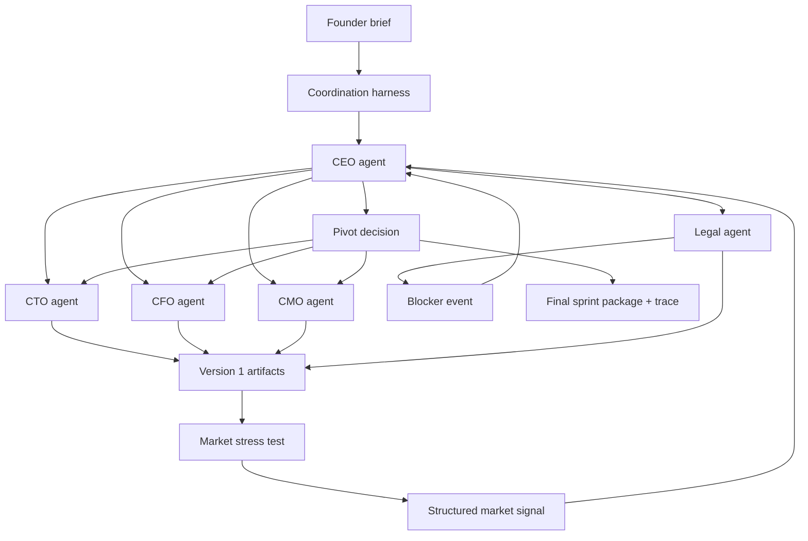

# Ghost Board

Ghost Board is a hackathon project for running an autonomous company sprint with an AI executive team. A founder provides a startup brief, Ghost Board spins up CEO, CTO, CFO, CMO, and Legal agents, and the system is designed to produce a prototype, financial model, GTM copy, compliance memo, and a trace of every decision and pivot.

The core idea is two nested feedback loops:

- Inner loop: executive agents coordinate over a typed async event bus.
- Outer loop: a lightweight market simulation pressure-tests version one artifacts and feeds structured signals back into the board.

This repository is currently a planning-and-bootstrap scaffold. The PRD, task tracker, and setup scripts are present; the actual Python application modules described in the PRD have not been implemented yet.

## Why this exists

Ghost Board is aiming to demonstrate a real causal chain rather than a one-shot prompt:

1. Founder brief becomes strategy.
2. Strategy is delegated to specialized agents.
3. Legal or market feedback can interrupt execution.
4. CEO issues a pivot.
5. CTO, CFO, and CMO revise their artifacts.
6. The trace shows exactly what caused each downstream change.

The included demo concept is Anchrix, a compliance-aware stablecoin payout control plane for US fintechs.

## Planned architecture



## Current repository contents

What is actually in the repo today:

| Path | Purpose |
| --- | --- |
| `PRD.md` | Main product requirements document describing the full Ghost Board vision and acceptance criteria. |
| `ghost_board_final_prd.md` | Duplicate copy of the final PRD. |
| `CLAUDE.md` | Builder instructions for an autonomous iteration loop that completes one roadmap item at a time. |
| `progress.txt` | Task-by-task build checklist. All items are still unchecked. |
| `anchrix_concept.txt` | Demo seed concept used for the first run. |
| `requirements.txt` | Planned Python dependency set for the future implementation. |
| `.env.example` | Required and optional environment variables. |
| `setup.sh` | Bash bootstrap script for initial project scaffolding and dependency installation. |
| `setup_mirofish.sh` | Bash setup for optional MiroFish and BettaFish reference integrations plus a simulation bridge stub. |
| `RALPH_LOOP.sh` | Repeated autonomous build loop for Claude Code / Ralph-style execution. |
| `.claude/settings.local.json` | Local Claude permissions config. |

What is notably missing right now:

- No `main.py`
- No `agents/`, `coordination/`, `simulation/`, `tests/`, or `demo/` source directories
- No executable Python implementation of the event bus or agents
- No generated artifacts under `outputs/`

## Target repo shape

The PRD expects the repo to grow into something close to:

```text
ghost-board/
|-- README.md
|-- .env.example
|-- requirements.txt
|-- main.py
|-- agents/
|-- coordination/
|-- simulation/
|-- tests/
|-- outputs/
|-- demo/
`-- vendor/
```

The intended core modules are:

- `agents/`: CEO, CTO, CFO, CMO, and Legal agents
- `coordination/`: typed events, async state bus, trace logging
- `simulation/`: personas, social simulation engine, signal analyzer
- `outputs/`: generated prototype, financial model, GTM assets, compliance memo
- `tests/`: unit and end-to-end validation for the orchestration flow

## Build roadmap

`progress.txt` is the source of truth for implementation order. The roadmap is:

1. Project skeleton and CLI entry point
2. Typed event models
3. Async pub/sub state bus
4. Trace logger with W&B fallback
5. Base agent abstraction
6. CEO agent
7. CTO agent
8. Legal agent
9. CFO agent
10. CMO agent
11. Persona generator
12. Simulation engine
13. Simulation analyzer
14. End-to-end orchestration
15. End-to-end tests
16. Demo mode and final docs

At the time of this README, none of those steps have been marked complete.

## Environment

Copy `.env.example` to `.env` and provide at least:

```bash
OPENAI_API_KEY=sk-...
```

Optional keys:

```bash
WANDB_API_KEY=...
WANDB_PROJECT=ghost-board
ANTHROPIC_API_KEY=sk-ant-...
```

Notes:

- `OPENAI_API_KEY` is required for the planned agent and simulation calls.
- `WANDB_API_KEY` enables trace logging to Weights & Biases.
- `ANTHROPIC_API_KEY` is only needed if you use the Claude-based Ralph loop workflow included in this repo.

## Dependencies

The planned Python stack from `requirements.txt` is:

- `openai`
- `wandb`
- `pydantic`
- `rich`
- `click`
- `python-dotenv`
- `aiohttp`
- `pytest`
- `pytest-asyncio`

## Setup

The bootstrap scripts are currently written for a Unix-like shell environment such as macOS, Linux, WSL, or Git Bash.

Basic setup flow:

```bash
cp .env.example .env
# fill in your API keys

bash setup.sh
```

Optional reference-tool setup:

```bash
bash setup_mirofish.sh
```

What `setup.sh` is intended to do:

- verify Python, Git, and optional Claude CLI availability
- initialize a git repo if needed
- create the planned source/output directories
- install Python dependencies into a virtual environment
- clone `MiroFish` and `BettaFish` under `vendor/`
- create `.env`

What `setup_mirofish.sh` is intended to do:

- clone or reuse `MiroFish` and `BettaFish`
- configure them against OpenAI credentials
- install their dependencies
- generate `simulation/mirofish_bridge.py`
- fall back to a custom lightweight simulation if MiroFish is unavailable

## Autonomous build workflow

`RALPH_LOOP.sh` is the repo's autonomous execution wrapper. On each iteration it:

1. Reads `progress.txt`
2. Finds the first unchecked task
3. Invokes Claude Code to complete exactly one task
4. Runs tests
5. Marks the task complete
6. Commits the result
7. Repeats until all tasks are finished or the iteration cap is reached

Example:

```bash
bash RALPH_LOOP.sh 50
```

This script assumes the project has already been scaffolded and that the `claude` CLI is installed and authenticated.

## Demo concept

The included demo seed, `anchrix_concept.txt`, frames Ghost Board around:

- compliance-aware stablecoin payouts
- US fintechs, neobanks, and payroll platforms
- built-in KYC/AML and money transmission compliance concerns
- a market wedge where crypto rails and compliance are usually separated

This concept is well-suited for Ghost Board because it naturally creates:

- legal blockers
- pricing and margin tradeoffs
- enterprise GTM questions
- room for a visible pivot cascade

## Important implementation constraints from the PRD

The docs in this repo repeatedly lock in a few design decisions:

- The coordination layer must be event-driven, not a sequential pipeline.
- Events should use typed Pydantic payloads rather than loose dictionaries.
- Legal outputs must include grounded citations to real regulatory material.
- CTO is expected to use a code-focused OpenAI model for prototype generation.
- The market simulation should stay lightweight for hackathon reliability.
- Every event should carry lineage through a `triggered_by` field.

If you continue building this repo, those constraints should be treated as hard requirements rather than optional preferences.

## Known gaps

Based on the repo analysis, the biggest gaps are:

- the project is still documentation-first
- the setup scripts describe files that do not yet exist in the repo
- `PRD.md` and `ghost_board_final_prd.md` overlap heavily
- the expected `demo/anchrix_concept.txt` path has not been created yet
- the README task in `progress.txt` was planned for after the actual implementation, but this README documents the current state now

## Credits and inspiration

This repo explicitly references or plans around:

- Ralph-style autonomous build loops
- Claude Code as one autonomous builder path
- OpenAI / Codex for the CTO implementation path
- Weights & Biases for execution tracing
- MiroFish as inspiration for the market simulation loop
- BettaFish as inspiration for sentiment-analysis patterns

The roadmap also mentions the broader hackathon builder ecosystem around OpenClaw, oh-my-opencode, and oh-my-claude-code as optional implementation details rather than core dependencies.

## Recommended next step

If you want this repo to become runnable, the next concrete move is still `PRD-01` from `progress.txt`: create the actual Python project skeleton with `main.py`, package directories, `.env` loading, and a minimal CLI entry point.
