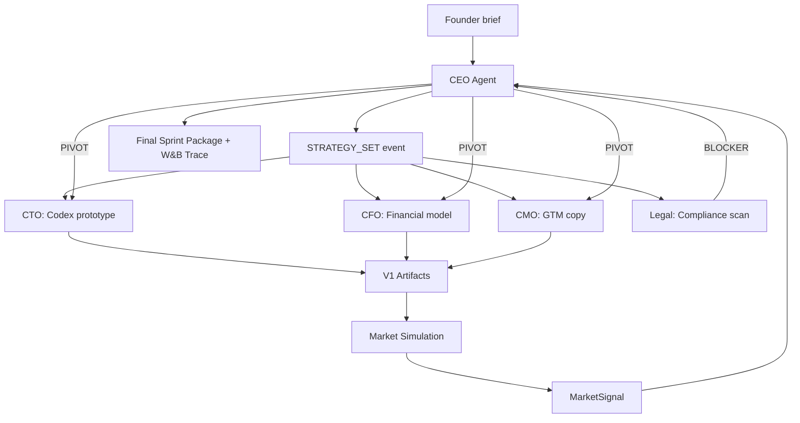

# Ghost Board


Autonomous AI executive team that builds AND validates a startup in a single sprint.

```
CEO ──> Strategy ──> CTO (Codex prototype)
  |                  CFO (Financial model)
  |                  CMO (GTM & copy)
  |                  Legal (Compliance + citations)
  |
  |   BLOCKER? ──> CEO pivots ──> All agents rebuild
  |
  └──> Simulation (synthetic VCs, users, journalists, competitors)
       |
       └──> Market signal ──> CEO pivots again if needed ──> Final output
```

## Architecture

Two nested feedback loops:

**Inner loop:** Five AI agents (CEO, CTO, CFO, CMO, Legal) coordinate via an async event bus. When Legal flags a compliance blocker with real regulation citations, CEO pivots strategy, and the pivot cascades to all other agents.

**Outer loop:** After v1 artifacts are produced, CEO triggers a MiroFish-inspired market stress test. Synthetic stakeholders (VCs, early adopters, skeptics, journalists, competitors, regulators) react in a turn-based simulation. Their structured feedback flows back to CEO, who pivots again if needed.



## Quick Start

```bash
# 1. Set API keys
export OPENAI_API_KEY="sk-..."
export WANDB_API_KEY="..."  # optional, falls back to JSON

# 2. Install dependencies
pip install -r requirements.txt

# 3. Run with default idea
python main.py

# 4. Run with custom idea
python main.py "AI-powered supply chain optimization for restaurants"

# 5. Run demo (Anchrix concept)
python main.py --demo

# 6. Customize simulation
python main.py --personas 15 --rounds 5

# 7. Skip simulation (build only)
python main.py --skip-simulation
```

## Output

All artifacts are saved to `outputs/`:

| Directory | Contents |
|-----------|----------|
| `outputs/prototype/` | Generated Python code (via OpenAI Codex) |
| `outputs/financial_model/` | 3-year projections (JSON + Markdown) |
| `outputs/gtm/` | Landing page copy, launch plan |
| `outputs/compliance/` | Regulatory analysis with real citations |
| `outputs/trace.json` | Full event trace (W&B fallback) |
| `outputs/sprint_summary.json` | Final summary with costs |

## Event System

Agents communicate via typed events on an async pub/sub bus:

| Event | Source | Triggers |
|-------|--------|----------|
| `STRATEGY_SET` | CEO | All agents start building |
| `BLOCKER` | Legal | CEO evaluates pivot |
| `PIVOT` | CEO | All agents rebuild |
| `SIMULATION_RESULT` | Engine | CEO evaluates second pivot |
| `PROTOTYPE_READY` | CTO | Logged to trace |
| `FINANCIAL_MODEL_READY` | CFO | Logged to trace |
| `GTM_READY` | CMO | Logged to trace |

Every event has a `triggered_by` field linking it to its cause, creating a full causal chain visible in W&B or the JSON trace.

## Project Structure

```
ghost-board/
|-- main.py                # CLI entry point + 3-phase orchestration
|-- agents/
|   |-- base.py            # BaseAgent with LLM calls + W&B logging
|   |-- ceo.py             # Strategy, blocker handling, pivots
|   |-- cto.py             # Codex-powered prototype generation
|   |-- cfo.py             # Financial model generation
|   |-- cmo.py             # Positioning and GTM copy
|   └── legal.py           # Compliance with real citations
|-- coordination/
|   |-- events.py          # EventType enum + typed Pydantic payloads
|   |-- state.py           # Async pub/sub StateBus
|   └── trace.py           # W&B + JSON trace logger
|-- simulation/
|   |-- personas.py        # MarketPersona generator
|   |-- engine.py          # Turn-based social simulation
|   |-- analyzer.py        # Sentiment aggregation -> MarketSignal
|   └── mirofish_bridge.py # MiroFish/BettaFish bridge with fallback
|-- tests/
|   |-- test_events.py     # Event bus pub/sub tests
|   |-- test_agents.py     # Agent behavior tests (mocked LLM)
|   |-- test_simulation.py # Simulation tests
|   └── test_e2e.py        # Full cascade E2E test
|-- demo/
|   └── anchrix_concept.txt
|-- outputs/               # Runtime artifacts (gitignored)
└── vendor/                # MiroFish + BettaFish reference repos
```

## Tech Stack

- **Python 3.11+** with asyncio for agent coordination
- **OpenAI API** (gpt-4o for C-suite, gpt-4o-mini for simulation)
- **Pydantic** for typed event payloads
- **W&B** for execution traces (optional, graceful JSON fallback)
- **Click** for CLI
- **MiroFish bridge** with automatic fallback to local simulation

## Testing

```bash
python -m pytest tests/ -x --tb=short
```

39 tests covering:
- Event bus pub/sub mechanics (19 tests including edge cases)
- Agent behavior with mocked LLM responses (9 tests including max pivot, retry)
- Simulation personas, engine, and analyzer (7 tests)
- Full cascade E2E: strategy -> build -> blocker -> pivot -> rebuild (4 tests)

## Demo Concept

The included demo concept (`--demo` flag) is **Anchrix**: an AI-powered identity verification and compliance platform for fintech. It naturally creates legal blockers (money transmission, KYC/AML), pricing tradeoffs, and visible pivot cascades.

## Credits

- **[Ralph Loop](https://github.com/anthropics/claude-code)** by Geoffrey Huntley - Autonomous build loop technique
- **[MiroFish](https://github.com/666ghj/MiroFish)** by Guo Hangjiang - Social simulation architecture inspiration
- **[BettaFish](https://github.com/666ghj/BettaFish)** - Sentiment analysis patterns
- **[W&B](https://wandb.ai)** - Execution tracing and observability
- **[oh-my-opencode](https://github.com/nicepkg/oh-my-opencode)** by Q - Claude Code extensions
- **[oh-my-claude-code](https://github.com/nicepkg/oh-my-claude-code)** by Yeachan Heo - Claude Code plugins
- **[OpenClaw](https://github.com/nicepkg/OpenClaw)** by George Zhang - Agent orchestration patterns

## License

MIT

---

*Built at Ralphthon SF 2026*
